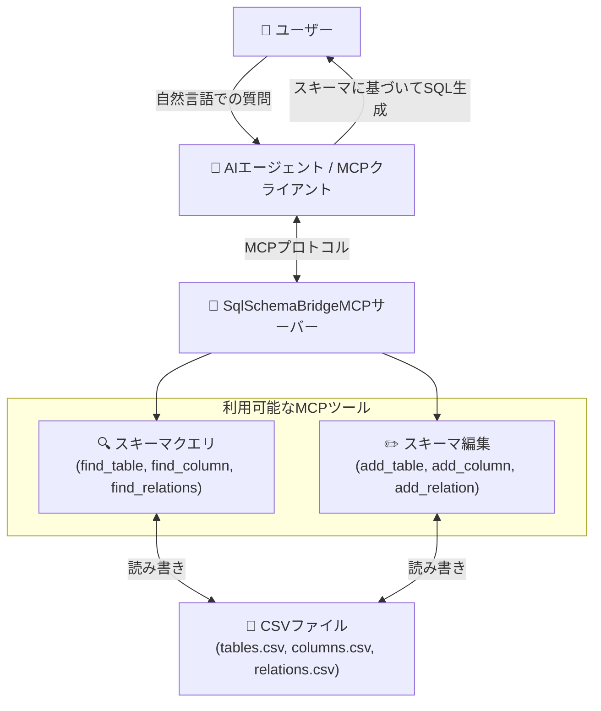

# SQL Schema Bridge MCPサーバー

## 概要



`SqlSchemaBridgeMCP`は、自然言語とSQLの間のギャップを埋めるために設計されたModel-Context-Protocol (MCP) サーバーです。AIエージェントにデータベーススキーマに関する必要なメタデータ（テーブル定義、列の詳細、リレーションシップなど）を提供し、エージェントがユーザーの質問に基づいてSQLクエリを正確に構築できるようにします。

このサーバーは、ローカルのCSVファイルからデータベーススキーマ情報を読み込むため、ユーザーは特定のデータベース環境のメタデータを簡単に管理および更新できます。

## 動作の仕組み

ユーザーがデータに関する質問（例：「各顧客の最新の注文日を表示して」）をすると、AIエージェントはこのMCPサーバーと対話してデータベースの構造を理解します。


1.  エージェントは`find_table`や`find_column`のようなツールを呼び出して、論理名（「顧客」、「注文日」）をデータベース内の物理的な対応物（`Customers`、`OrderDate`）にマッピングします。
2.  エージェントは`find_relations`を使用して、テーブルがどのように接続されているか（例：`Customers.CustomerID` -> `Orders.CustomerID`）を発見します。
3.  取得したメタデータを使用して、エージェントはユーザーの質問に答えるための正確なSQLクエリを組み立てます。

## 特徴

-   **自然言語からSQLへ：** AIエージェントが自然言語の質問を正確なSQLクエリに翻訳するのを助けます。
-   **ローカルでのメタデータ管理：** データベーススキーマ情報は、ローカルマシンに保存された簡単なCSVファイルを通じて管理されます。
-   **プロファイルサポート：** プロファイルを使用して、異なるデータベーススキーマ定義を簡単に切り替えることができます。これは、複数のプロジェクトや環境（開発、テスト、本番など）を管理するのに理想的です。

## 利用者向け: はじめに

サーバーをダウンロードし、設定、実行する手順は以下の通りです。

### 1. インストール

1.  このプロジェクトの[GitHub Releases page](https://github.com/yt3trees/SqlSchemaBridgeMCP/releases)へアクセスします。
2.  お使いのオペレーティングシステムに対応したリリースパッケージ（例: `SqlSchemaBridgeMCP-win-x64.zip`）をダウンロードします。
3.  ダウンロードしたzipファイルを任意の場所に展開します。

### 2. 設定

#### メタデータファイルの作成

サーバーは、ユーザのドキュメントフォルダ内に配置された専用フォルダ内のCSVファイルからスキーマ情報を読み込みます。

**ディレクトリ構造:** 

まず、ドキュメントフォルダ（`C:\Users\<UserName>\Documents`）に`SqlSchemaBridgeMCP`という名前のフォルダが必要です。このフォルダがまだ存在しない場合は、手動で作成する必要があります。

`SqlSchemaBridgeMCP`ディレクトリを設置したら、その中に使用したい各プロファイル用のサブディレクトリを作成します。

```
\SqlSchemaBridgeMCP
|-- \ProjectA
|   |-- tables.csv
|   |-- columns.csv
|   |-- relations.csv
|-- \Test
|   |-- tables.csv
|   |-- columns.csv
|   |-- relations.csv
```

#### サンプルプロファイルの作成: `ProjectA`

以下のファイルを `C:\Users\<UserName>\Documents\SqlSchemaBridgeMCP\ProjectA` ディレクトリに作成します。

**`tables.csv`**
```csv
database_name,schema_name,logical_name,physical_name,primary_key,description
SalesDB,dbo,Customers,M_CUSTOMERS,CUSTOMER_ID,"Table to store basic customer information."
SalesDB,dbo,Order Headers,T_ORDER_HEADERS,ORDER_ID,"Stores order information from customers."
SalesDB,dbo,Products,M_PRODUCTS,PRODUCT_ID,"Master data for product information."
SalesDB,dbo,Order Details,T_ORDER_DETAILS,ORDER_DETAIL_ID,"Stores order detail information."
```

**`columns.csv`**
```csv
table_physical_name,logical_name,physical_name,data_type,description
M_CUSTOMERS,CustomerID,CUSTOMER_ID,int,"Primary key for the Customers table."
M_CUSTOMERS,CustomerName,CUSTOMER_NAME,"nvarchar(100)","Name of the customer."
M_CUSTOMERS,Address,ADDRESS,"nvarchar(255)",
T_ORDER_HEADERS,OrderID,ORDER_ID,int,"Primary key for the Order Headers table."
T_ORDER_HEADERS,CustomerID,CUSTOMER_ID,int,"Foreign key to the Customers table."
T_ORDER_HEADERS,OrderDate,ORDER_DATE,datetime,
T_ORDER_HEADERS,TotalAmount,TOTAL_AMOUNT,decimal,
M_PRODUCTS,ProductID,PRODUCT_ID,int,
M_PRODUCTS,ProductName,PRODUCT_NAME,"nvarchar(100)",
M_PRODUCTS,UnitPrice,UNIT_PRICE,decimal,
T_ORDER_DETAILS,OrderDetailID,ORDER_DETAIL_ID,int,
T_ORDER_DETAILS,OrderID,ORDER_ID,int,
T_ORDER_DETAILS,ProductID,PRODUCT_ID,int,
T_ORDER_DETAILS,Quantity,QUANTITY,int,
```

**`relations.csv`**
```csv
source_table,source_column,target_table,target_column
M_CUSTOMERS,CUSTOMER_ID,T_ORDER_HEADERS,CUSTOMER_ID
T_ORDER_HEADERS,ORDER_ID,T_ORDER_DETAILS,ORDER_ID
M_PRODUCTS,PRODUCT_ID,T_ORDER_DETAILS,PRODUCT_ID
```

### 3. Gemini CLIの設定

Gemini CLIからこのMCPサーバーを利用するには、`gemini`コマンドラインツールがサーバーを起動できるように設定が必要です。

`gemini`の設定ファイル（通常はユーザーのホームディレクトリの `.gemini/settings.json` にあります）に、以下の`mcpServers`設定を追加または更新します。

```json
{
  "mcpServers": {
    "SqlSchemaBridgeMCP": {
      "type": "stdio",
      "command": "C:\\path\\to\\your\\extracted\\folder\\SqlSchemaBridgeMCP.exe",
      "args": [],
      "env": {
        "DB_PROFILE": "ProjectA"
      }
    }
  }
}
```

**設定のポイント:**

-   `command`: `SqlSchemaBridgeMCP.exe`の絶対パスに置き換えてください。これは、[インストール](#1-インストール)のステップでzipファイルを展開した場所です。
-   `env.DB_PROFILE`: 使用したいプロファイル名（例: `ProjectA`）に設定します。このプロファイルは、[メタデータファイルの作成](#メタデータファイルの作成)で設定したディレクトリ名と一致する必要があります。

macOSやLinuxの場合は、`command`を `./SqlSchemaBridgeMCP` のような実行可能ファイルへのパスに設定します。

---


## 開発者向け: ローカル開発

### ローカルでの開発セットアップ

ソースコードからこのMCPサーバーをテストするには、IDEを設定して`dotnet run`で直接プロジェクトを実行することができます。これは開発目的で推奨されます。

起動設定で`DB_PROFILE`環境変数を設定し、目的のテストプロファイルを指すようにします。

```json
{
  "mcpServers": {
    "SqlSchemaBridgeMCP": {
      "type": "stdio",
      "command": "dotnet",
      "args": [
        "run",
        "--project",
        "C:\\work\\SqlSchemaBridgeMCP"
      ],
      "env": {
        "DB_PROFILE": "ProjectA"
      }
    }
  }
}
```

### リリースビルドの作成（自己完結型）

配布用に、サーバーを自己完結型アプリケーションとして公開することができます。これにより、.NETランタイムがインストールされていないマシンでもアプリケーションを実行できるように、.NETランタイムがアプリケーションにバンドルされます。

`dotnet publish`コマンドを実行し、ターゲットランタイム識別子（RID）を指定します。

```sh
# Windows x64向け
dotnet publish -c Release -r win-x64 --self-contained true

# Linux x64向け
dotnet publish -c Release -r linux-x64 --self-contained true

# macOS x64向け
dotnet publish -c Release -r osx-x64 --self-contained true
```

出力は`bin/Release/net8.0/<RID>/publish/`ディレクトリに配置されます。

## 利用可能なツール

サーバーは、AIエージェント向けの包括的なツールセットを公開しており、スキーマのクエリとスキーマの編集の2つの主要なカテゴリに分かれています。

### スキーマ照会ツール

これらのツールにより、エージェントはデータベーススキーマを検査できます。

#### `list_tables`
-   **説明**: `tables.csv`で定義されている利用可能なすべてのテーブルを一覧表示します。
-   **引数**: なし。
-   **戻り値**: すべてのテーブル定義のリスト。

#### `find_table`
-   **説明**: 論理名または物理名でテーブルを検索し、すべての一致を返します。
-   **引数**:
    -   `logical_name: str` (任意): テーブルの論理名 (例: "Customers")。
    -   `physical_name: str` (任意): テーブルの物理名 (例: "M_CUSTOMERS")。
    -   `exact_match: bool` (任意): `true`の場合、大文字と小文字を区別しない完全一致を実行します。デフォルトは`false` (部分一致)。
-   **戻り値**: 一致するテーブル定義のリスト。

#### `find_column`
-   **説明**: 論理名または物理名で列を検索します。検索はテーブル名で絞り込むことができます。テーブル名のみが指定された場合、そのテーブルのすべての列が返されます。
-   **引数**:
    -   `logical_name: str` (任意): 列の論理名 (例: "Customer Name")。
    -   `physical_name: str` (任意): 列の物理名 (例: "CUSTOMER_NAME")。
    -   `table_name: str` (任意): 検索対象のテーブルの物理名。
    -   `exact_match: bool` (任意): `true`の場合、大文字と小文字を区別しない完全一致を実行します。デフォルトは`false` (部分一致)。
-   **戻り値**: 一致する列定義のリスト。

#### `find_relations`
-   **説明**: 指定されたテーブルのリレーションシップと結合条件を検索します。
-   **引数**:
    -   `table_name: str`: テーブルの物理名 (例: "M_CUSTOMERS")。
    -   `exact_match: bool` (任意): `true`の場合、大文字と小文字を区別しない完全一致を実行します。デフォルトは`false` (部分一致)。
-   **戻り値**: ソースとターゲットのテーブルおよび列を指定するリレーションのリスト。

#### `get_profile_instructions`
-   **説明**: 現在のプロファイルのディレクトリに`README.md`ファイルが存在する場合、AI向けの指示を取得します。これは、特定のデータベースのスキーマを解釈する方法に関する具体的なガイダンスを提供するために使用できます。
-   **引数**: なし。
-   **戻り値**: プロファイル固有の指示を含む文字列。指示が見つからない場合はデフォルトのメッセージ。

### スキーマ編集ツール

これらのツールにより、エージェントは基になるCSVファイルを編集してスキーマを変更できます。

#### `add_table`
-   **説明**: `tables.csv`に新しいテーブル定義を追加します。
-   **引数**:
    -   `logical_name: str`: テーブルの論理名。
    -   `physical_name: str`: テーブルの物理名。
    -   `primary_key: str`: テーブルの主キー。
    -   `description: str`: テーブルの説明。
    -   `database_name: str` (任意): データベースの物理名。
    -   `schema_name: str` (任意): スキーマの物理名。
-   **戻り値**: 確認メッセージ。

#### `delete_table`
-   **説明**: `tables.csv`からテーブル定義を削除します。
-   **引数**:
    -   `physical_name: str`: 削除するテーブルの物理名。
-   **戻り値**: 確認メッセージ。

#### `add_column`
-   **説明**: `columns.csv`に新しい列定義を追加します。
-   **引数**:
    -   `table_physical_name: str`: この列が属するテーブルの物理名。
    -   `logical_name: str`: 列の論理名。
    -   `physical_name: str`: 列の物理名。
    -   `data_type: str`: 列のデータ型。
    -   `description: str` (任意): 列の説明。
-   **戻り値**: 確認メッセージ。

#### `delete_column`
-   **説明**: `columns.csv`から列定義を削除します。
-   **引数**:
    -   `table_physical_name: str`: 列が属するテーブルの物理名。
    -   `physical_name: str`: 削除する列の物理名。
-   **戻り値**: 確認メッセージ。

#### `add_relation`
-   **説明**: `relations.csv`に新しいリレーションシップ定義を追加します。
-   **引数**:
    -   `source_table: str`: ソーステーブルの物理名。
    -   `source_column: str`: ソース列の物理名。
    -   `target_table: str`: ターゲットテーブルの物理名。
    -   `target_column: str`: ターゲット列の物理名。
-   **戻り値**: 確認メッセージ。

#### `delete_relation`
-   **説明**: `relations.csv`からリレーションシップ定義を削除します。
-   **引数**:
    -   `source_table: str`: ソーステーブルの物理名。
    -   `source_column: str`: ソース列の物理名。
    -   `target_table: str`: ターゲットテーブルの物理名。
    -   `target_column: str`: ターゲット列の物理名。
-   **戻り値**: 確認メッセージ。