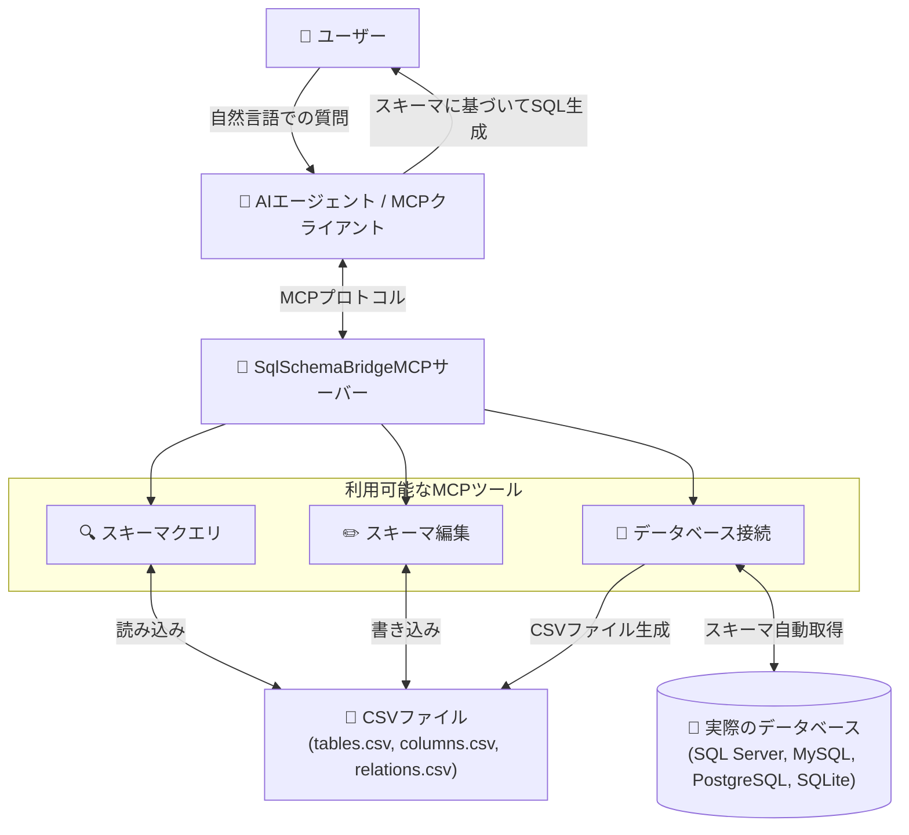
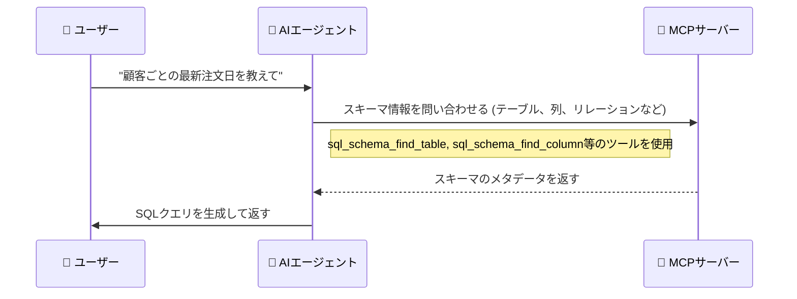

# SQL Schema Bridge MCPサーバー


[](https://www.nuget.org/packages/SqlSchemaBridgeMCP)

## 概要



`SqlSchemaBridgeMCP`は、自然言語とSQLの間のギャップを埋めるために設計されたModel-Context-Protocol (MCP) サーバーです。AIエージェントにデータベーススキーマに関する必要なメタデータ(テーブル定義、列の詳細、リレーションシップなど)を提供し、エージェントがユーザーの質問に基づいてSQLクエリを正確に構築できるようにします。

このサーバーは2つの方法でスキーマ情報を管理できます：
- **手動管理：** ローカルのCSVファイルからデータベーススキーマ情報を読み込み
- **自動インポート：** 実際のデータベース（SQL Server、MySQL、PostgreSQL、SQLite）に直接接続してスキーマを自動取得

## 動作の仕組み

ユーザーがデータに関する質問(例：「各顧客の最新の注文日を表示して」)をすると、AIエージェントはこのMCPサーバーと対話してデータベースの構造を理解します。



1.  エージェントは`sql_schema_find_table`や`sql_schema_find_column`のようなツールを呼び出して、論理名(「顧客」、「注文日」)をデータベース内の物理的な対応物(`Customers`、`OrderDate`)にマッピングします。
2.  エージェントは`sql_schema_find_relations`を使用して、テーブルがどのように接続されているか(例：`Customers.CustomerID` -> `Orders.CustomerID`)を発見します。
3.  取得したメタデータを使用して、エージェントはユーザーの質問に答えるための正確なSQLクエリを組み立てます。

## 特徴

-   **自然言語からSQLへ：** AIエージェントが自然言語の質問を正確なSQLクエリに翻訳するのを助けます。
-   **データベース直接接続：** SQL Server、MySQL、PostgreSQL、SQLiteから直接スキーマ情報を自動取得できます。
-   **ローカルでのメタデータ管理：** データベーススキーマ情報は、ローカルマシンに保存された簡単なCSVファイルを通じて管理されます。
-   **プロファイルサポート：** プロファイルを使用して、異なるデータベーススキーマ定義を簡単に切り替えることができます。これは、複数のプロジェクトや環境(開発、テスト、本番など)を管理するのに理想的です。

## 利用者向け: はじめに

MCPサーバーを設定し、実行する手順は以下の通りです。

### 1. インストール

MCPサーバーのインストールには2つの方法があります。

#### オプション1：GitHubリリースからダウンロード

1.  このプロジェクトの[GitHub Releases page](https://github.com/yt3trees/SqlSchemaBridgeMCP/releases)へアクセスします。
2.  お使いのオペレーティングシステムに対応したリリースパッケージ(例: `SqlSchemaBridgeMCP-win-x64.zip`)をダウンロードします。
3.  ダウンロードしたzipファイルを任意の場所に展開します。

> [!NOTE]  
> この方法は、.NETランタイムが含まれており、追加のインストールが不要なため最も簡単です。新しいバージョンがリリースされた場合、最新の機能を利用するには手動で再度ダウンロードする必要がある点にご注意ください。

#### オプション2：dnxを使用してNuGetからインストール

このオプションは、.NET SDKがインストール済みで、`dnx`コマンドラインツールの利用を希望する方向けです。

1.  **前提条件**: [.NET 10 SDK](https://dotnet.microsoft.com/download/dotnet)以降をインストールしてください。

> [!TIP]
> `dnx`コマンドを初めて実行すると、`SqlSchemaBridgeMCP`パッケージがNuGetから自動的に取得され、常に最新のバージョンが使用されます。

### 2. MCPクライアントの設定

MCPクライアント(Gemini CLI等)からこのMCPサーバーを利用するには、クライアントがサーバーを起動できるように設定が必要です。クライアントの設定ファイル(例: `~/.gemini/settings.json`)に、以下の`mcpServers`設定を追加または更新します。

#### オプション1の場合(GitHubリリース)

```json
{
  "mcpServers": {
    "SqlSchemaBridgeMCP": {
      "type": "stdio",
      "command": "C:\\path\\to\\your\\extracted\\folder\\SqlSchemaBridgeMCP.exe",
      "args": []
    }
  }
}
```
-   **`command`**: 展開した`SqlSchemaBridgeMCP.exe`への絶対パスに置き換えてください。
-   macOSやLinuxの場合は、`command`を `./SqlSchemaBridgeMCP` のような実行可能ファイルへのパスに設定します。

#### オプション2の場合(dnx)

```json
{
  "mcpServers": {
    "SqlSchemaBridgeMCP": {
      "type": "stdio",
      "command": "dnx",
      "args": [
        "SqlSchemaBridgeMCP",
        "--yes"
      ]
    }
  }
}
```
- `dnx`コマンドがサーバーのダウンロードと実行を管理します。


### 3. メタデータの設定

サーバーは、プロファイルディレクトリにあるCSVファイルからスキーマ情報を読み込みます。プロファイルの検索場所は以下の2箇所です。
1.  環境変数 `SQLSCHEMABRIDGEMCP_PROFILES_PATH` で指定されたパス（設定されている場合）
2.  ユーザーのホームディレクトリにあるデフォルトの `.SqlSchemaBridgeMCP` フォルダ (例: Windowsでは `C:\Users\<UserName>`、macOS/Linuxでは `~/`)

**ディレクトリ構造:**

プロファイルフォルダ（例：`ProjectA`、`Test`）は、上記のいずれの場所にも配置できます。サーバーはすべての検索パスからプロファイルを収集します。

同じ名前のプロファイルが複数の場所に存在する場合、環境変数で指定されたパス内のプロファイルが優先されます。

現在アクティブなプロファイルを保存する `.current_profile` ファイルは、常にデフォルトの `~/.SqlSchemaBridgeMCP` ディレクトリ内で管理されます。

各プロファイルルートディレクトリの中に、使用したい各プロファイル用のサブディレクトリを作成します。

```
\.SqlSchemaBridgeMCP
|-- \ProjectA
|   |-- tables.csv
|   |-- columns.csv
|   |-- relations.csv
|-- \Test
|   |-- tables.csv
|   |-- columns.csv
|   |-- relations.csv
```

#### サンプルプロファイルの作成: `ProjectA`

以下のファイルを `C:\Users\<UserName>\.SqlSchemaBridgeMCP\ProjectA` ディレクトリに作成します。

**`tables.csv`**
```csv
database_name,schema_name,logical_name,physical_name,primary_key,description
SalesDB,dbo,Customers,M_CUSTOMERS,CUSTOMER_ID,"Table to store basic customer information."
SalesDB,dbo,Order Headers,T_ORDER_HEADERS,ORDER_ID,"Stores order information from customers."
SalesDB,dbo,Products,M_PRODUCTS,PRODUCT_ID,"Master data for product information."
SalesDB,dbo,Order Details,T_ORDER_DETAILS,ORDER_DETAIL_ID,"Stores order detail information."
```

**`columns.csv`**
```csv
table_physical_name,logical_name,physical_name,data_type,description
M_CUSTOMERS,CustomerID,CUSTOMER_ID,int,"Primary key for the Customers table."
M_CUSTOMERS,CustomerName,CUSTOMER_NAME,"nvarchar(100)","Name of the customer."
M_CUSTOMERS,Address,ADDRESS,"nvarchar(255)",
T_ORDER_HEADERS,OrderID,ORDER_ID,int,"Primary key for the Order Headers table."
T_ORDER_HEADERS,CustomerID,CUSTOMER_ID,int,"Foreign key to the Customers table."
T_ORDER_HEADERS,OrderDate,ORDER_DATE,datetime,
T_ORDER_HEADERS,TotalAmount,TOTAL_AMOUNT,decimal,
M_PRODUCTS,ProductID,PRODUCT_ID,int,
M_PRODUCTS,ProductName,PRODUCT_NAME,"nvarchar(100)",
M_PRODUCTS,UnitPrice,UNIT_PRICE,decimal,
T_ORDER_DETAILS,OrderDetailID,ORDER_DETAIL_ID,int,
T_ORDER_DETAILS,OrderID,ORDER_ID,int,
T_ORDER_DETAILS,ProductID,PRODUCT_ID,int,
T_ORDER_DETAILS,Quantity,QUANTITY,int,
```

**`relations.csv`**
```csv
source_table,source_column,target_table,target_column
M_CUSTOMERS,CUSTOMER_ID,T_ORDER_HEADERS,CUSTOMER_ID
T_ORDER_HEADERS,ORDER_ID,T_ORDER_DETAILS,ORDER_ID
M_PRODUCTS,PRODUCT_ID,T_ORDER_DETAILS,PRODUCT_ID
```

**設定のポイント:**

-   **プロファイル設定不要**: サーバーは初回起動時に`default`プロファイルを使用し、`sql_schema_switch_profile`ツールで動的に切り替えできます。

### 4. プロファイルの管理

#### 初回起動
- サーバーは自動的に`default`プロファイルを使用します
- プロファイルが存在しない場合でも、利用可能なプロファイルを`sql_schema_list_available_profiles`ツールで確認できます

#### プロファイルの切り替え
AIまたはユーザーは以下のツールを使用してプロファイルを管理できます：

- **`sql_schema_switch_profile(profile_name)`**: 指定されたプロファイルに切り替え
- **`sql_schema_get_current_profile()`**: 現在使用中のプロファイル情報を取得
- **`sql_schema_list_available_profiles()`**: 利用可能なプロファイル一覧を表示

#### 永続化
- プロファイル切り替えは設定ファイル(`.current_profile`)に保存されます
- 次回起動時も同じプロファイルが自動的に使用されます

---


## 開発者向け: ローカル開発

### ローカルでの開発セットアップ

ソースコードからこのMCPサーバーをテストするには、IDEを設定して`dotnet run`で直接プロジェクトを実行することができます。これは開発目的で推奨されます。

```json
{
  "mcpServers": {
    "SqlSchemaBridgeMCP": {
      "type": "stdio",
      "command": "dotnet",
      "args": [
        "run",
        "--project",
        "C:\\work\\SqlSchemaBridgeMCP"
      ]
    }
  }
}
```

**開発時のプロファイル管理:**
- 開発時もプロファイル切り替えは`sql_schema_switch_profile`ツールを使用
- 設定ファイルによる永続化により、開発セッション間でプロファイルが保持されます

### リリースビルドの作成(自己完結型)

配布用に、サーバーを自己完結型アプリケーションとして公開することができます。これにより、.NETランタイムがインストールされていないマシンでもアプリケーションを実行できるように、.NETランタイムがアプリケーションにバンドルされます。

`dotnet publish`コマンドを実行し、ターゲットランタイム識別子(RID)を指定します。

```sh
# Windows x64向け
dotnet publish -c Release -r win-x64 --self-contained true

# Linux x64向け
dotnet publish -c Release -r linux-x64 --self-contained true

# macOS x64向け
dotnet publish -c Release -r osx-x64 --self-contained true
```

出力は`bin/Release/net8.0/<RID>/publish/`ディレクトリに配置されます。