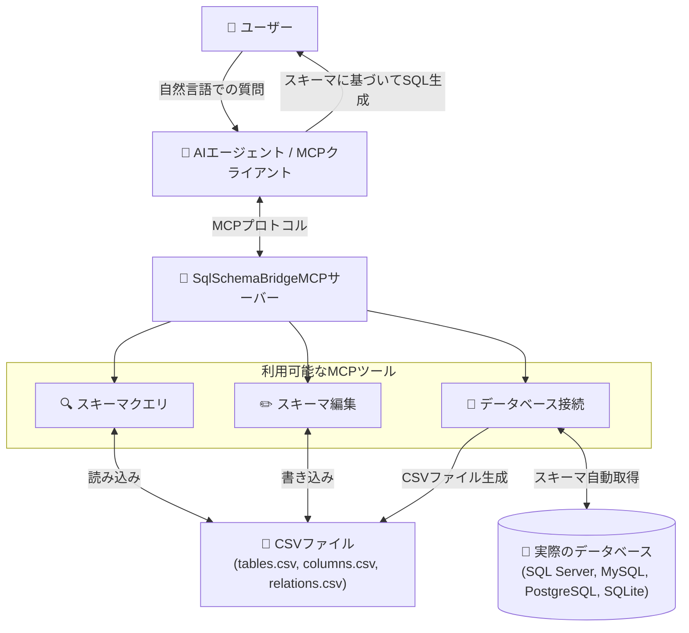
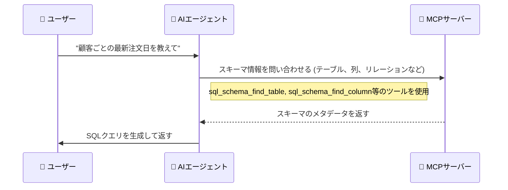

# SQL Schema Bridge MCPサーバー


[](https://www.nuget.org/packages/SqlSchemaBridgeMCP)

## 概要



`SqlSchemaBridgeMCP`は、自然言語とSQLの間のギャップを埋めるために設計されたModel-Context-Protocol (MCP) サーバーです。AIエージェントにデータベーススキーマに関する必要なメタデータ(テーブル定義、列の詳細、リレーションシップなど)を提供し、エージェントがユーザーの質問に基づいてSQLクエリを正確に構築できるようにします。

このサーバーは2つの方法でスキーマ情報を管理できます：
- **手動管理：** ローカルのCSVファイルからデータベーススキーマ情報を読み込み
- **自動インポート：** 実際のデータベース（SQL Server、MySQL、PostgreSQL、SQLite）に直接接続してスキーマを自動取得

## 動作の仕組み

ユーザーがデータに関する質問(例：「各顧客の最新の注文日を表示して」)をすると、AIエージェントはこのMCPサーバーと対話してデータベースの構造を理解します。



1.  エージェントは`sql_schema_find_table`や`sql_schema_find_column`のようなツールを呼び出して、論理名(「顧客」、「注文日」)をデータベース内の物理的な対応物(`Customers`、`OrderDate`)にマッピングします。
2.  エージェントは`sql_schema_find_relations`を使用して、テーブルがどのように接続されているか(例：`Customers.CustomerID` -> `Orders.CustomerID`)を発見します。
3.  取得したメタデータを使用して、エージェントはユーザーの質問に答えるための正確なSQLクエリを組み立てます。

## 特徴

-   **自然言語からSQLへ：** AIエージェントが自然言語の質問を正確なSQLクエリに翻訳するのを助けます。
-   **データベース直接接続：** SQL Server、MySQL、PostgreSQL、SQLiteから直接スキーマ情報を自動取得できます。
-   **ローカルでのメタデータ管理：** データベーススキーマ情報は、ローカルマシンに保存された簡単なCSVファイルを通じて管理されます。
-   **プロファイルサポート：** プロファイルを使用して、異なるデータベーススキーマ定義を簡単に切り替えることができます。これは、複数のプロジェクトや環境(開発、テスト、本番など)を管理するのに理想的です。

## 利用者向け: はじめに

MCPサーバーを設定し、実行する手順は以下の通りです。

### 1. インストール

MCPサーバーのインストールには2つの方法があります。

#### オプション1：GitHubリリースからダウンロード

1.  このプロジェクトの[GitHub Releases page](https://github.com/yt3trees/SqlSchemaBridgeMCP/releases)へアクセスします。
2.  お使いのオペレーティングシステムに対応したリリースパッケージ(例: `SqlSchemaBridgeMCP-win-x64.zip`)をダウンロードします。
3.  ダウンロードしたzipファイルを任意の場所に展開します。

> [!NOTE]  
> この方法は、.NETランタイムが含まれており、追加のインストールが不要なため最も簡単です。新しいバージョンがリリースされた場合、最新の機能を利用するには手動で再度ダウンロードする必要がある点にご注意ください。

#### オプション2：dnxを使用してNuGetからインストール

このオプションは、.NET SDKがインストール済みで、`dnx`コマンドラインツールの利用を希望する方向けです。

1.  **前提条件**: [.NET 10 SDK](https://dotnet.microsoft.com/download/dotnet)以降をインストールしてください。

> [!TIP]
> `dnx`コマンドを初めて実行すると、`SqlSchemaBridgeMCP`パッケージがNuGetから自動的に取得され、常に最新のバージョンが使用されます。

### 2. MCPクライアントの設定

MCPクライアント(Gemini CLI等)からこのMCPサーバーを利用するには、クライアントがサーバーを起動できるように設定が必要です。クライアントの設定ファイル(例: `~/.gemini/settings.json`)に、以下の`mcpServers`設定を追加または更新します。

#### オプション1の場合(GitHubリリース)

```json
{
  "mcpServers": {
    "SqlSchemaBridgeMCP": {
      "type": "stdio",
      "command": "C:\\path\\to\\your\\extracted\\folder\\SqlSchemaBridgeMCP.exe",
      "args": []
    }
  }
}
```
-   **`command`**: 展開した`SqlSchemaBridgeMCP.exe`への絶対パスに置き換えてください。
-   macOSやLinuxの場合は、`command`を `./SqlSchemaBridgeMCP` のような実行可能ファイルへのパスに設定します。

#### オプション2の場合(dnx)

```json
{
  "mcpServers": {
    "SqlSchemaBridgeMCP": {
      "type": "stdio",
      "command": "dnx",
      "args": [
        "SqlSchemaBridgeMCP",
        "--yes"
      ]
    }
  }
}
```
- `dnx`コマンドがサーバーのダウンロードと実行を管理します。


### 3. メタデータの設定

サーバーは、プロファイルディレクトリにあるCSVファイルからスキーマ情報を読み込みます。プロファイルの検索場所は以下の2箇所です。
1.  環境変数 `SQLSCHEMABRIDGEMCP_PROFILES_PATH` で指定されたパス（設定されている場合）
2.  ユーザーのホームディレクトリにあるデフォルトの `.SqlSchemaBridgeMCP` フォルダ (例: Windowsでは `C:\Users\<UserName>`、macOS/Linuxでは `~/`)

**ディレクトリ構造:**

プロファイルフォルダ（例：`ProjectA`、`Test`）は、上記のいずれの場所にも配置できます。サーバーはすべての検索パスからプロファイルを収集します。

同じ名前のプロファイルが複数の場所に存在する場合、環境変数で指定されたパス内のプロファイルが優先されます。

現在アクティブなプロファイルを保存する `.current_profile` ファイルは、常にデフォルトの `~/.SqlSchemaBridgeMCP` ディレクトリ内で管理されます。

各プロファイルルートディレクトリの中に、使用したい各プロファイル用のサブディレクトリを作成します。

```
\.SqlSchemaBridgeMCP
|-- \ProjectA
|   |-- tables.csv
|   |-- columns.csv
|   |-- relations.csv
|-- \Test
|   |-- tables.csv
|   |-- columns.csv
|   |-- relations.csv
```

#### サンプルプロファイルの作成: `ProjectA`

以下のファイルを `C:\Users\<UserName>\.SqlSchemaBridgeMCP\ProjectA` ディレクトリに作成します。

**`tables.csv`**
```csv
database_name,schema_name,logical_name,physical_name,primary_key,description
SalesDB,dbo,Customers,M_CUSTOMERS,CUSTOMER_ID,"Table to store basic customer information."
SalesDB,dbo,Order Headers,T_ORDER_HEADERS,ORDER_ID,"Stores order information from customers."
SalesDB,dbo,Products,M_PRODUCTS,PRODUCT_ID,"Master data for product information."
SalesDB,dbo,Order Details,T_ORDER_DETAILS,ORDER_DETAIL_ID,"Stores order detail information."
```

**`columns.csv`**
```csv
table_physical_name,logical_name,physical_name,data_type,description
M_CUSTOMERS,CustomerID,CUSTOMER_ID,int,"Primary key for the Customers table."
M_CUSTOMERS,CustomerName,CUSTOMER_NAME,"nvarchar(100)","Name of the customer."
M_CUSTOMERS,Address,ADDRESS,"nvarchar(255)",
T_ORDER_HEADERS,OrderID,ORDER_ID,int,"Primary key for the Order Headers table."
T_ORDER_HEADERS,CustomerID,CUSTOMER_ID,int,"Foreign key to the Customers table."
T_ORDER_HEADERS,OrderDate,ORDER_DATE,datetime,
T_ORDER_HEADERS,TotalAmount,TOTAL_AMOUNT,decimal,
M_PRODUCTS,ProductID,PRODUCT_ID,int,
M_PRODUCTS,ProductName,PRODUCT_NAME,"nvarchar(100)",
M_PRODUCTS,UnitPrice,UNIT_PRICE,decimal,
T_ORDER_DETAILS,OrderDetailID,ORDER_DETAIL_ID,int,
T_ORDER_DETAILS,OrderID,ORDER_ID,int,
T_ORDER_DETAILS,ProductID,PRODUCT_ID,int,
T_ORDER_DETAILS,Quantity,QUANTITY,int,
```

**`relations.csv`**
```csv
source_table,source_column,target_table,target_column
M_CUSTOMERS,CUSTOMER_ID,T_ORDER_HEADERS,CUSTOMER_ID
T_ORDER_HEADERS,ORDER_ID,T_ORDER_DETAILS,ORDER_ID
M_PRODUCTS,PRODUCT_ID,T_ORDER_DETAILS,PRODUCT_ID
```

**設定のポイント:**

-   **プロファイル設定不要**: サーバーは初回起動時に`default`プロファイルを使用し、`sql_schema_switch_profile`ツールで動的に切り替えできます。

### 4. プロファイルの管理

#### 初回起動
- サーバーは自動的に`default`プロファイルを使用します
- プロファイルが存在しない場合でも、利用可能なプロファイルを`sql_schema_list_available_profiles`ツールで確認できます

#### プロファイルの切り替え
AIまたはユーザーは以下のツールを使用してプロファイルを管理できます：

- **`sql_schema_switch_profile(profile_name)`**: 指定されたプロファイルに切り替え
- **`sql_schema_get_current_profile()`**: 現在使用中のプロファイル情報を取得
- **`sql_schema_list_available_profiles()`**: 利用可能なプロファイル一覧を表示

#### 永続化
- プロファイル切り替えは設定ファイル(`.current_profile`)に保存されます
- 次回起動時も同じプロファイルが自動的に使用されます

---


## 開発者向け: ローカル開発

### ローカルでの開発セットアップ

ソースコードからこのMCPサーバーをテストするには、IDEを設定して`dotnet run`で直接プロジェクトを実行することができます。これは開発目的で推奨されます。

```json
{
  "mcpServers": {
    "SqlSchemaBridgeMCP": {
      "type": "stdio",
      "command": "dotnet",
      "args": [
        "run",
        "--project",
        "C:\\work\\SqlSchemaBridgeMCP"
      ]
    }
  }
}
```

**開発時のプロファイル管理:**
- 開発時もプロファイル切り替えは`sql_schema_switch_profile`ツールを使用
- 設定ファイルによる永続化により、開発セッション間でプロファイルが保持されます

### リリースビルドの作成(自己完結型)

配布用に、サーバーを自己完結型アプリケーションとして公開することができます。これにより、.NETランタイムがインストールされていないマシンでもアプリケーションを実行できるように、.NETランタイムがアプリケーションにバンドルされます。

`dotnet publish`コマンドを実行し、ターゲットランタイム識別子(RID)を指定します。

```sh
# Windows x64向け
dotnet publish -c Release -r win-x64 --self-contained true

# Linux x64向け
dotnet publish -c Release -r linux-x64 --self-contained true

# macOS x64向け
dotnet publish -c Release -r osx-x64 --self-contained true
```

出力は`bin/Release/net8.0/<RID>/publish/`ディレクトリに配置されます。

## データベース接続・スキーマ自動インポート

### 対応データベース

このサーバーは以下のデータベースからの直接スキーマインポートに対応しています：

- **Microsoft SQL Server** - Windows認証またはSQL Server認証
- **MySQL** - バージョン5.7以降
- **PostgreSQL** - バージョン10以降  
- **SQLite** - ローカルファイルベースのデータベース

### 接続文字列の例

#### SQL Server
```
Server=localhost;Database=MyDatabase;Integrated Security=true;
Server=localhost;Database=MyDatabase;User Id=myuser;Password=mypass;
```

#### MySQL
```
Server=localhost;Database=test;Uid=root;Pwd=password;Port=3306;
```

#### PostgreSQL
```
Host=localhost;Database=mydb;Username=postgres;Password=mypass;Port=5432;
```

#### SQLite
```
Data Source=C:\path\to\database.db;
```

### 使用方法

データベースから直接スキーマをインポートするには、以下のツールを使用します：

```
# データベースへの接続をテスト
TestDatabaseConnection(
    databaseType: "SqlServer",
    connectionString: "Server=localhost;Database=MyDB;Integrated Security=true;"
)

# スキーマをインポートして新しいプロファイルを作成・切り替え
ImportAndSwitchToProfile(
    databaseType: "SqlServer", 
    connectionString: "Server=localhost;Database=MyDB;Integrated Security=true;",
    profileName: "MyProject"
)
```

## 利用可能なツール

サーバーは、AIエージェント向けの包括的なツールセットを公開しており、スキーマクエリ、スキーマ編集、プロファイル管理、プロファイル検証、データベース接続の5つの主要なカテゴリに分かれています。

### スキーマクエリツール

これらのツールにより、エージェントはデータベーススキーマを検査でき、結果はCSV形式で返されます。

#### `sql_schema_get_profile_instructions`
-   **説明**: 現在のプロファイルのディレクトリに`README.md`ファイルが存在する場合、AI向けの指示を取得します。**このMCPサーバーを使用する際は、このツールを最初に実行する必要があります。**
-   **引数**: なし。
-   **戻り値**: プロファイル固有の指示を含む文字列。指示が見つからない場合はデフォルトのメッセージ。

#### `sql_schema_find_table`
-   **説明**: 論理名または物理名でテーブルを検索し、すべての一致をCSV形式で返します。
-   **引数**:
    -   `logicalName: str` (任意): テーブルの論理名 (例: "Customers")。
    -   `physicalName: str` (任意): テーブルの物理名 (例: "M_CUSTOMERS")。
    -   `databaseName: str` (任意): 検索対象のデータベースの物理名。
    -   `schemaName: str` (任意): 検索対象のスキーマの物理名。
    -   `exactMatch: bool` (任意): `true`の場合、大文字と小文字を区別しない完全一致を実行します。デフォルトは`false` (部分一致)。
    -   `useRegex: bool` (任意): 名前検索で正規表現マッチングを有効にします。`true`の場合、exactMatchより優先されます。デフォルトは`false`。
-   **戻り値**: CSV形式のテーブルデータ。

#### `sql_schema_find_column`
-   **説明**: 論理名または物理名で列を検索し、結果をCSV形式で返します。検索はtable_nameで絞り込むことができます。table_nameのみが指定された場合、そのテーブルのすべての列が返されます。**推奨**: テーブル名でフィルターをかける際は、まずexactMatch=trueを使用してより正確な結果を取得することをお勧めします。**注意**: 結果が大きすぎてトークン制限の問題を引き起こす場合は、exactMatch=trueを使用してより具体的な結果を取得してください。
-   **引数**:
    -   `logicalName: str` (任意): 列の論理名 (例: "Customer Name")。
    -   `physicalName: str` (任意): 列の物理名 (例: "CUSTOMER_NAME")。
    -   `tableName: str` (任意): 検索対象のテーブルの物理名 (例: "M_CUSTOMERS")。
    -   `exactMatch: bool` (任意): `true`の場合、大文字と小文字を区別しない完全一致を実行します。デフォルトは`false` (部分一致)。
    -   `useRegex: bool` (任意): 名前検索で正規表現マッチングを有効にします。`true`の場合、exactMatchより優先されます。デフォルトは`false`。
-   **戻り値**: CSV形式の列データ(最大1000件)。

#### `sql_schema_find_relations`
-   **説明**: 指定されたテーブルのリレーションシップと結合条件を検索し、結果をCSV形式で返します。
-   **引数**:
    -   `tableName: str`: テーブルの物理名 (例: "M_CUSTOMERS")。
    -   `exactMatch: bool` (任意): `true`の場合、大文字と小文字を区別しない完全一致を実行します。デフォルトは`false` (部分一致)。
    -   `useRegex: bool` (任意): テーブル名検索で正規表現マッチングを有効にします。`true`の場合、exactMatchより優先されます。デフォルトは`false`。
-   **戻り値**: CSV形式のリレーションデータ。

### スキーマ編集ツール

これらのツールにより、エージェントは基になるCSVファイルを編集してスキーマを変更できます。

#### `sql_schema_manage_schema`
-   **説明**: スキーマ要素(テーブル、列、リレーション)の追加/削除操作を管理します。
-   **引数**:
    -   `operation: str`: 実行する操作: 'add' または 'delete'。
    -   `elementType: str`: 要素のタイプ: 'table'、'column'、または 'relation'。
    -   `logicalName: str` (任意): 論理名(テーブル/列用)。
    -   `physicalName: str` (任意): 物理名(テーブル/列用)または列のテーブル物理名。
    -   `primaryKeyOrDataType: str` (任意): 主キー(テーブル用)またはデータ型(列用)。
    -   `description: str` (任意): 要素の説明。
    -   `databaseName: str` (任意): データベース名(テーブル用)。
    -   `schemaName: str` (任意): スキーマ名(テーブル用)。
    -   `tablePhysicalNameOrSourceTable: str` (任意): テーブル物理名(列用)またはソーステーブル(リレーション用)。
    -   `sourceColumn: str` (任意): ソース列(リレーション用)。
    -   `targetTable: str` (任意): ターゲットテーブル(リレーション用)。
    -   `targetColumn: str` (任意): ターゲット列(リレーション用)。
-   **戻り値**: 成功メッセージ。

**使用例:**

**テーブルの追加:**
```
sql_schema_manage_schema(operation="add", elementType="table", logicalName="Customers", physicalName="M_CUSTOMERS", primaryKeyOrDataType="CUSTOMER_ID", description="顧客マスターテーブル")
```

**テーブルの削除:**
```
sql_schema_manage_schema(operation="delete", elementType="table", physicalName="M_CUSTOMERS")
```

**列の追加:**
```
sql_schema_manage_schema(operation="add", elementType="column", tablePhysicalNameOrSourceTable="M_CUSTOMERS", logicalName="Customer Name", physicalName="CUSTOMER_NAME", primaryKeyOrDataType="nvarchar(100)", description="顧客名")
```

**列の削除:**
```
sql_schema_manage_schema(operation="delete", elementType="column", tablePhysicalNameOrSourceTable="M_CUSTOMERS", physicalName="CUSTOMER_NAME")
```

**リレーションの追加:**
```
sql_schema_manage_schema(operation="add", elementType="relation", tablePhysicalNameOrSourceTable="M_CUSTOMERS", sourceColumn="CUSTOMER_ID", targetTable="T_ORDER_HEADERS", targetColumn="CUSTOMER_ID")
```

**リレーションの削除:**
```
sql_schema_manage_schema(operation="delete", elementType="relation", tablePhysicalNameOrSourceTable="M_CUSTOMERS", sourceColumn="CUSTOMER_ID", targetTable="T_ORDER_HEADERS", targetColumn="CUSTOMER_ID")
```

### プロファイル管理ツール

これらのツールにより、AIまたはユーザーはプロファイルを動的に切り替えて管理できます。

#### `sql_schema_switch_profile`
-   **説明**: 異なるプロファイルに切り替えて、スキーマデータを再読み込みします。
-   **引数**:
    -   `profileName: str`: 切り替え先のプロファイル名。
-   **戻り値**: 成功状況、プロファイル情報、スキーマ件数を含むJSONオブジェクト。

#### `sql_schema_get_current_profile`
-   **説明**: 現在のプロファイル情報を取得します。
-   **引数**: なし。
-   **戻り値**: 現在のプロファイル情報とスキーマ件数を含むJSONオブジェクト。

#### `sql_schema_reload_schema`
-   **説明**: 現在のプロファイルからスキーマデータを再読み込みします。
-   **引数**: なし。
-   **戻り値**: 再読み込み状況と前後のスキーマ件数を含むJSONオブジェクト。

#### `sql_schema_create_profile`
-   **説明**: 新しいプロファイルディレクトリを作成し、オプションで初期スキーマファイルを作成します。
-   **引数**:
    -   `profileName: str`: 作成するプロファイル名。
    -   `description: str` (任意): プロファイルのオプション説明。
    -   `createSampleFiles: bool` (任意): サンプルCSVファイルを作成するかどうか。デフォルトは`false`。
-   **戻り値**: 作成状況と作成されたファイル一覧を含むJSONオブジェクト。

#### `sql_schema_generate_csv`
-   **説明**: 指定されたタイプに基づいてスキーマデータのCSVファイルを生成します。
-   **引数**:
    -   `csvType: str`: 生成するCSVのタイプ: 'tables'、'columns'、'relations'、または'all'。
    -   `outputPath: str` (任意): 出力ディレクトリパス(デフォルトは現在のプロファイルディレクトリ)。
-   **戻り値**: 生成状況とファイル情報を含むJSONオブジェクト。

### プロファイル検証ツール

これらのツールにより、プロファイルのCSVファイル設定を検証し、データの整合性を確保できます。

#### `sql_schema_validate_profile`
-   **説明**: 指定されたプロファイルのCSVファイル設定を検証します。
-   **引数**:
    -   `profileName: str` (任意): 検証するプロファイル名。省略時は現在のプロファイルを検証。
-   **戻り値**: 検証結果、エラー、警告、詳細レポートを含むJSONオブジェクト。

#### `sql_schema_list_available_profiles`
-   **説明**: 利用可能なプロファイル一覧を取得します。
-   **引数**: なし。
-   **戻り値**: 利用可能なプロファイル一覧とその完全性状況を含むJSONオブジェクト。

#### `sql_schema_validate_all_profiles`
-   **説明**: 利用可能なすべてのプロファイルを検証します。
-   **引数**: なし。
-   **戻り値**: 全プロファイルの検証サマリーを含むJSONオブジェクト。

### データベース接続ツール

これらのツールにより、実際のデータベースに直接接続してスキーマ情報を自動取得できます。

#### `TestDatabaseConnection`
-   **説明**: 指定されたデータベースへの接続をテストします。
-   **引数**:
    -   `databaseType: str`: データベースタイプ（SqlServer、MySQL、PostgreSQL、SQLite）
    -   `connectionString: str`: データベースへの接続文字列
-   **戻り値**: 接続テストの結果を含むJSONオブジェクト。

#### `ImportDatabaseSchema`  
-   **説明**: データベースからスキーマ情報を取得して指定されたプロファイルに保存します。
-   **引数**:
    -   `databaseType: str`: データベースタイプ（SqlServer、MySQL、PostgreSQL、SQLite）
    -   `connectionString: str`: データベースへの接続文字列
    -   `profileName: str`: 保存先のプロファイル名
    -   `connectionName: str` (任意): 接続の参照名
-   **戻り値**: インポート結果とスキーマ統計を含むJSONオブジェクト。

#### `ImportAndSwitchToProfile`
-   **説明**: データベースからスキーマをインポートし、同時に新しいプロファイルに切り替えます。
-   **引数**:
    -   `databaseType: str`: データベースタイプ（SqlServer、MySQL、PostgreSQL、SQLite）
    -   `connectionString: str`: データベースへの接続文字列  
    -   `profileName: str`: 作成・切り替え先のプロファイル名
    -   `connectionName: str` (任意): 接続の参照名
-   **戻り値**: インポート結果と現在のプロファイル情報を含むJSONオブジェクト。

#### `GetSupportedDatabaseTypes`
-   **説明**: サポートされているデータベースタイプの一覧を取得します。
-   **引数**: なし。
-   **戻り値**: サポート対応データベースの一覧と表示名を含むJSONオブジェクト。