# SQL Schema Bridge MCP Server

## Overview

```mermaid
graph TB
    subgraph "User Environment"
        User["👤 User"]
        ProfileDir["📁 Profile Directory<br/>(e.g., ~/Documents/SqlSchemaBridgeMCP/ProjectA)"]
        CSVs["📄 CSV Files<br/>(tables.csv, columns.csv, relations.csv)"]

        subgraph "Client Application"
            Agent["🤖 AI Agent / MCP Client<br/>(e.g., Gemini CLI, VSCode)"]
        end
    end


    subgraph "SqlSchemaBridgeMCP Server (C#)"
        direction TB

        subgraph "Core Components"
            Server["🚀 MCP Server (C#)"]
            ProfileManager["🗂️ Profile Manager<br/>(Reads DB_PROFILE env var)"]
        end

        subgraph "Services"
            SchemaProvider["📖 Schema Provider<br/>(Reads CSV files)"]
            SchemaEditor["✍️ Schema Editor<br/>(Writes to CSV files)"]
        end

        subgraph "Available Tools"
            direction LR
            QueryTools["🔍 Schema Querying<br/>(find_table, find_column, find_relations, etc.)"]
            EditTools["✏️ Schema Editing<br/>(add_table, add_column, add_relation, etc.)"]
        end
    end

    %% Data Flow
    User -->|"Asks a question<br/>'Show top 10 products by sales'"| Agent
    ProfileDir -->|Contains| CSVs

    %% Client-Server Communication
    Agent <-->|"MCP Calls"| Server

    %% Server Internal Flow
    Server --> ProfileManager
    ProfileManager -->|"Selects Profile"| SchemaProvider
    ProfileManager -->|"Selects Profile"| SchemaEditor

    SchemaProvider -->|"Reads from"| CSVs
    SchemaEditor -->|"Writes to"| CSVs

    Server --> QueryTools
    Server --> EditTools
    QueryTools --> SchemaProvider
    EditTools --> SchemaEditor

    %% Agent builds the query
    Agent -->|"1.find_table('products')<br/>2. find_column('sales')<br/>3. ... etc."| QueryTools
    QueryTools -->|"Returns schema info"| Agent
    Agent -->|"Constructs SQL query based on schema"| Agent
```



`SqlSchemaBridgeMCP` is a Model-Context-Protocol (MCP) server designed to bridge the gap between natural language and SQL. It provides an AI agent with the necessary metadata about a database schema—such as table definitions, column details, and relationships—enabling the agent to accurately construct SQL queries based on user questions.

This server reads database schema information from local CSV files, making it easy for users to manage and update the metadata for their specific database environments.

## How It Works

When a user asks a question about data (e.g., "Show me the latest order date for each customer"), the AI agent interacts with this MCP server to understand the database structure:

```mermaid
sequenceDiagram
    participant User as 👤 User
    participant Agent as 🤖 AI Agent
    participant MCPServer as 🚀 MCP Server
    participant DBInfo as 📄 Database Info (.csv)

    User->>Agent: "Show me the latest order date for each customer"
    Agent->>MCPServer: find_table<br>(logical_name="customer")
    MCPServer->>DBInfo: Read tables.csv
    DBInfo-->>MCPServer: "customer" -> "Customers"
    MCPServer-->>Agent: {"physical_name": "Customers", ...}
    Agent->>MCPServer: find_table<br>(logical_name="order")
    MCPServer->>DBInfo: Read tables.csv
    DBInfo-->>MCPServer: "order" -> "Orders"
    MCPServer-->>Agent: {"physical_name": "Orders", ...}
    Agent->>MCPServer: find_relations<br>(table_name="Customers")
    MCPServer->>DBInfo: Read relations.csv
    DBInfo-->>MCPServer: "Customers.CustomerID <br>-> Orders.CustomerID"
    MCPServer-->>Agent: {"source_table": "Customers", <br>"target_table": "Orders", ...}
    Agent->>MCPServer: find_column<br>(logical_name="order date")
    MCPServer->>DBInfo: Read columns.csv
    DBInfo-->>MCPServer: "order date" -> "OrderDate"
    MCPServer-->>Agent: {"physical_name": "OrderDate", ...}
    Agent->>User: SELECT <br>T1.CustomerName, MAX(T2.OrderDate)<br>FROM Customers AS T1 <br> JOIN Orders AS T2 <br>ON T1.CustomerID = T2.CustomerID <br>GROUP BY T1.CustomerName;
```



1.  The agent calls tools like `find_table` and `find_column` to map logical names ("customer", "order date") to their physical counterparts in the database (`Customers`, `OrderDate`).
2.  The agent uses `find_relations` to discover how tables are connected (e.g., `Customers.CustomerID` -> `Orders.CustomerID`).
3.  Using the retrieved metadata, the agent assembles a precise SQL query to answer the user's question.

## Features

-   **Natural Language to SQL:** Helps AI agents translate natural language questions into accurate SQL queries.
-   **Local Metadata Management:** Database schema information is managed through simple CSV files stored on your local machine.
-   **Profile Support:** Easily switch between different database schema definitions using profiles. This is ideal for managing multiple projects or environments (e.g., development, testing, production).

## For Users: Getting Started

Follow these steps to download, configure, and run the server.

### 1. Installation

1.  Go to the [GitHub Releases page](https://github.com/yt3trees/SqlSchemaBridgeMCP/releases) for this project.
2.  Download the release package for your operating system (e.g., `SqlSchemaBridgeMCP-win-x64.zip`).
3.  Extract the downloaded zip file to a location of your choice.

### 2. Configuration

#### Create Metadata Files

The server loads schema information from CSV files located in a dedicated folder within your user's documents directory.

**Directory Structure:**

First, you will need a folder named `SqlSchemaBridgeMCP` inside your user's Documents folder (`C:\Users\<UserName>\Documents`). If this folder does not already exist, you must create it manually.

Once the `SqlSchemaBridgeMCP` directory is in place, create a subdirectory inside it for each profile you want to use.

```
\SqlSchemaBridgeMCP
|-- \ProjectA
|   |-- tables.csv
|   |-- columns.csv
|   |-- relations.csv
|-- \Test
|   |-- tables.csv
|   |-- columns.csv
|   |-- relations.csv
```

#### Create Example Profile: `ProjectA`

Create the files below in the `C:\Users\<UserName>\Documents\SqlSchemaBridgeMCP\ProjectA` directory.

**`tables.csv`**
```csv
database_name,schema_name,logical_name,physical_name,primary_key,description
SalesDB,dbo,Customers,M_CUSTOMERS,CUSTOMER_ID,"Table to store basic customer information."
SalesDB,dbo,Order Headers,T_ORDER_HEADERS,ORDER_ID,"Stores order information from customers."
SalesDB,dbo,Products,M_PRODUCTS,PRODUCT_ID,"Master data for product information."
SalesDB,dbo,Order Details,T_ORDER_DETAILS,ORDER_DETAIL_ID,"Stores order detail information."
```

**`columns.csv`**
```csv
table_physical_name,logical_name,physical_name,data_type,description
M_CUSTOMERS,CustomerID,CUSTOMER_ID,int,"Primary key for the Customers table."
M_CUSTOMERS,CustomerName,CUSTOMER_NAME,"nvarchar(100)","Name of the customer."
M_CUSTOMERS,Address,ADDRESS,"nvarchar(255)",
T_ORDER_HEADERS,OrderID,ORDER_ID,int,"Primary key for the Order Headers table."
T_ORDER_HEADERS,CustomerID,CUSTOMER_ID,int,"Foreign key to the Customers table."
T_ORDER_HEADERS,OrderDate,ORDER_DATE,datetime,
T_ORDER_HEADERS,TotalAmount,TOTAL_AMOUNT,decimal,
M_PRODUCTS,ProductID,PRODUCT_ID,int,
M_PRODUCTS,ProductName,PRODUCT_NAME,"nvarchar(100)",
M_PRODUCTS,UnitPrice,UNIT_PRICE,decimal,
T_ORDER_DETAILS,OrderDetailID,ORDER_DETAIL_ID,int,
T_ORDER_DETAILS,OrderID,ORDER_ID,int,
T_ORDER_DETAILS,ProductID,PRODUCT_ID,int,
T_ORDER_DETAILS,Quantity,QUANTITY,int,
```

**`relations.csv`**
```csv
source_table,source_column,target_table,target_column
M_CUSTOMERS,CUSTOMER_ID,T_ORDER_HEADERS,CUSTOMER_ID
T_ORDER_HEADERS,ORDER_ID,T_ORDER_DETAILS,ORDER_ID
M_PRODUCTS,PRODUCT_ID,T_ORDER_DETAILS,PRODUCT_ID
```

#### Set the Profile

The MCP server uses the `DB_PROFILE` environment variable to determine which profile to load at startup. Set this variable to the name of the profile directory you want to use (e.g., `ProjectA`).

If `DB_PROFILE` is not set, the server will fail to start.

### 3. Gemini CLI Configuration

To use this MCP server with the Gemini CLI, you need to configure the `gemini` command-line tool to launch the server.

Add or update the `mcpServers` configuration in your `gemini` settings file (usually located at `~/.gemini/settings.json` on Linux/macOS or `%USERPROFILE%\.gemini\settings.json` on Windows) with the following:

```json
{
  "mcpServers": {
    "SqlSchemaBridgeMCP": {
      "type": "stdio",
      "command": "C:\\path\\to\\your\\extracted\\folder\\SqlSchemaBridgeMCP.exe",
      "args": [],
      "env": {
        "DB_PROFILE": "ProjectA"
      }
    }
  }
}
```

**Key Configuration Points:**

-   `command`: Replace this with the absolute path to your `SqlSchemaBridgeMCP.exe`. This is the location where you extracted the zip file in the [Installation](#1-installation) step.
-   `env.DB_PROFILE`: Set this to the name of the profile you want to use (e.g., `ProjectA`). This must match the directory name you set up in the [Create Metadata Files](#create-metadata-files) step.

For macOS or Linux, the `command` should be the path to the executable, like `./SqlSchemaBridgeMCP`.

---


## For Developers: Local Development

### Local Development Setup

To test this MCP server from the source code, you can configure your IDE to run the project directly using `dotnet run`. This is recommended for development purposes.

Set the `DB_PROFILE` environment variable in your launch configuration to point to your desired test profile.

```json
{
  "mcpServers": {
    "SqlSchemaBridgeMCP": {
      "type": "stdio",
      "command": "dotnet",
      "args": [
        "run",
        "--project",
        "C:\\work\\SqlSchemaBridgeMCP"
      ],
      "env": {
        "DB_PROFILE": "ProjectA"
      }
    }
  }
}
```

### Creating a Release Build (Self-Contained)

For distribution, you can publish the server as a self-contained application. This bundles the .NET runtime with your application, so it can run on machines without the .NET runtime installed.

Run the `dotnet publish` command, specifying the target runtime identifier (RID).

```sh
# For Windows x64
dotnet publish -c Release -r win-x64 --self-contained true

# For Linux x64
dotnet publish -c Release -r linux-x64 --self-contained true

# For macOS x64
dotnet publish -c Release -r osx-x64 --self-contained true
```

The output will be placed in the `bin/Release/net8.0/<RID>/publish/` directory.

## Available Tools

The server exposes a comprehensive set of tools for the AI agent, divided into two main categories: schema querying and schema editing.

### Schema Querying Tools

These tools allow the agent to inspect the database schema.

#### `list_tables`
-   **Description**: Lists all available tables defined in `tables.csv`.
-   **Arguments**: None.
-   **Returns**: A list of all table definitions.

#### `find_table`
-   **Description**: Searches for tables by logical or physical name and returns all matches.
-   **Arguments**:
    -   `logical_name: str` (optional): The logical name of the table (e.g., "Customers").
    -   `physical_name: str` (optional): The physical name of the table (e.g., "M_CUSTOMERS").
    -   `database_name: str` (optional): The physical name of the database to search within.
    -   `schema_name: str` (optional): The physical name of the schema to search within.
    -   `exact_match: bool` (optional): If true, performs a case-insensitive exact match. Defaults to `false` (contains).
-   **Returns**: A list of matching table definitions.

#### `find_column`
-   **Description**: Searches for columns by logical or physical name. The search can be filtered by table name. If only a table name is provided, all columns for that table are returned.
-   **Arguments**:
    -   `logical_name: str` (optional): The logical name of the column (e.g., "Customer Name").
    -   `physical_name: str` (optional): The physical name of the column (e.g., "CUSTOMER_NAME").
    -   `table_name: str` (optional): The physical name of the table to search within.
    -   `exact_match: bool` (optional): If true, performs a case-insensitive exact match. Defaults to `false` (contains).
-   **Returns**: A list of matching column definitions.

#### `find_relations`
-   **Description**: Finds relationships and join conditions for a specified table.
-   **Arguments**:
    -   `table_name: str`: The physical name of the table (e.g., "M_CUSTOMERS").
    -   `exact_match: bool` (optional): If true, performs a case-insensitive exact match. Defaults to `false` (contains).
-   **Returns**: A list of relations, each specifying the source and target tables and columns.

#### `get_profile_instructions`
-   **Description**: Gets the instructions for the AI, if a `README.md` file is present in the current profile's directory. This can be used to provide specific guidance on how to interpret the schema for a particular database.
-   **Arguments**: None.
-   **Returns**: A string containing the profile-specific instructions, or a default message if no instructions are found.

### Schema Editing Tools

These tools allow the agent to modify the schema by editing the underlying CSV files.

#### `add_table`
-   **Description**: Adds a new table definition to `tables.csv`.
-   **Arguments**:
    -   `logical_name: str`: The logical name of the table.
    -   `physical_name: str`: The physical name of the table.
    -   `primary_key: str`: The primary key of the table.
    -   `description: str`: A description of the table.
    -   `database_name: str` (optional): The physical name of the database.
    -   `schema_name: str` (optional): The physical name of the schema.
-   **Returns**: A confirmation message.

#### `delete_table`
-   **Description**: Deletes a table definition from `tables.csv`.
-   **Arguments**:
    -   `physical_name: str`: The physical name of the table to delete.
-   **Returns**: A confirmation message.

#### `add_column`
-   **Description**: Adds a new column definition to `columns.csv`.
-   **Arguments**:
    -   `table_physical_name: str`: The physical name of the table this column belongs to.
    -   `logical_name: str`: The logical name of the column.
    -   `physical_name: str`: The physical name of the column.
    -   `data_type: str`: The data type of the column.
    -   `description: str` (optional): A description of the column.
-   **Returns**: A confirmation message.

#### `delete_column`
-   **Description**: Deletes a column definition from `columns.csv`.
-   **Arguments**:
    -   `table_physical_name: str`: The physical name of the table the column belongs to.
    -   `physical_name: str`: The physical name of the column to delete.
-   **Returns**: A confirmation message.

#### `add_relation`
-   **Description**: Adds a new relationship definition to `relations.csv`.
-   **Arguments**:
    -   `source_table: str`: The source table's physical name.
    -   `source_column: str`: The source column's physical name.
    -   `target_table: str`: The target table's physical name.
    -   `target_column: str`: The target column's physical name.
-   **Returns**: A confirmation message.

#### `delete_relation`
-   **Description**: Deletes a relationship definition from `relations.csv`.
-   **Arguments**:
    -   `source_table: str`: The source table's physical name.
    -   `source_column: str`: The source column's physical name.
    -   `target_table: str`: The target table's physical name.
    -   `target_column: str`: The target column's physical name.
-   **Returns**: A confirmation message.
