# SQL Schema Bridge MCP Server


[](https://www.nuget.org/packages/SqlSchemaBridgeMCP)

## Overview

```mermaid
graph TB
    User["👤 User"]
    Agent["🤖 AI Agent / MCP Client"]
    Server["🚀 SqlSchemaBridgeMCP Server"]
    CSVFiles["📄 CSV Files<br/>(tables.csv, columns.csv, relations.csv)"]

    subgraph "Available MCP Tools"
        QueryTools["🔍 Schema Querying"]
        EditTools["✏️ Schema Editing"]
    end

    %% Main Flow
    User -->|"Ask question in natural language"| Agent
    Agent <-->|"MCP Protocol"| Server
    Server --> QueryTools
    Server --> EditTools
    QueryTools <-->|"Read"| CSVFiles
    EditTools <-->|"Write"| CSVFiles
    Agent -->|"Generate SQL based on schema"| User
```



`SqlSchemaBridgeMCP` is a Model-Context-Protocol (MCP) server designed to bridge the gap between natural language and SQL. It provides an AI agent with the necessary metadata about a database schema—such as table definitions, column details, and relationships—enabling the agent to accurately construct SQL queries based on user questions.

This server reads database schema information from local CSV files, making it easy for users to manage and update the metadata for their specific database environments.

## How It Works

When a user asks a question about data (e.g., "Show me the latest order date for each customer"), the AI agent interacts with this MCP server to understand the database structure:

```mermaid
sequenceDiagram
    participant User as 👤 User
    participant Agent as 🤖 AI Agent
    participant MCPServer as 🚀 MCP Server

    User->>Agent: "Show me the latest order date for each customer"

    Agent->>MCPServer: Inquire about schema (e.g., tables, columns, relations)
    note right of Agent: Uses tools like sql_schema_find_table, sql_schema_find_column, etc.

    MCPServer-->>Agent: Return schema metadata

    Agent->>User: Generate and return SQL query
```



1.  The agent calls tools like `sql_schema_find_table` and `sql_schema_find_column` to map logical names ("customer", "order date") to their physical counterparts in the database (`Customers`, `OrderDate`).
2.  The agent uses `sql_schema_find_relations` to discover how tables are connected (e.g., `Customers.CustomerID` -> `Orders.CustomerID`).
3.  Using the retrieved metadata, the agent assembles a precise SQL query to answer the user's question.

## Features

-   **Natural Language to SQL:** Helps AI agents translate natural language questions into accurate SQL queries.
-   **Local Metadata Management:** Database schema information is managed through simple CSV files stored on your local machine.
-   **Profile Support:** Easily switch between different database schema definitions using profiles. This is ideal for managing multiple projects or environments (e.g., development, testing, production).

## For Users: Getting Started

Follow these steps to configure and run the MCP server.

### 1. Installation

You have two options for installing the MCP server.

#### Option 1: Download from GitHub Releases

1.  Go to the [GitHub Releases page](https://github.com/yt3trees/SqlSchemaBridgeMCP/releases) for this project.
2.  Download the release package for your operating system (e.g., `SqlSchemaBridgeMCP-win-x64.zip`).
3.  Extract the downloaded zip file to a location of your choice.

> [!NOTE]  
> This is the easiest method as it includes the .NET runtime and does not require any additional installations. Note that when a new version is released, you will need to download it manually to get the latest updates.

#### Option 2: Install from NuGet using dnx

This option is for users who have the .NET SDK installed and prefer to use the `dnx` command-line tool.

1.  **Prerequisite**: Install the [.NET 10 SDK](https://dotnet.microsoft.com/download/dotnet) or a later version.

> [!TIP]
> The `dnx` command will automatically fetch the `SqlSchemaBridgeMCP` package from NuGet the first time you run it, ensuring you are using the latest version available.


### 2. MCP Client Configuration

To use this MCP server with a client like the Gemini CLI, you need to configure the client to launch the server. Add or update the `mcpServers` configuration in your client's settings file (e.g., `~/.gemini/settings.json`).

#### For Option 1 (GitHub Release)

```json
{
  "mcpServers": {
    "SqlSchemaBridgeMCP": {
      "type": "stdio",
      "command": "C:\\path\\to\\your\\extracted\\folder\\SqlSchemaBridgeMCP.exe",
      "args": []
    }
  }
}
```
-   **`command`**: Replace this with the absolute path to the `SqlSchemaBridgeMCP.exe` you extracted.
-   For macOS or Linux, the `command` should be the path to the executable (e.g., `./SqlSchemaBridgeMCP`).

#### For Option 2 (dnx)

```json
{
  "mcpServers": {
    "SqlSchemaBridgeMCP": {
      "type": "stdio",
      "command": "dnx",
      "args": [
        "SqlSchemaBridgeMCP",
        "--yes"
      ]
    }
  }
}
```
- The `dnx` command handles the download and execution of the server.


### 3. Metadata Configuration

The server loads schema information from CSV files located in profile directories. The server searches for these profiles in two locations:
1.  The path specified by the `SQLSCHEMABRIDGEMCP_PROFILES_PATH` environment variable (if set).
2.  The default folder named `.SqlSchemaBridgeMCP` inside your user's home directory (e.g., `C:\Users\<UserName>` on Windows or `~/` on macOS/Linux).

**Directory Structure:**

You can place profile folders (like `ProjectA`, `Test`) inside either of the locations mentioned above. The server will aggregate profiles from all search paths.

If a profile with the same name exists in multiple locations, the one in the path specified by the environment variable will take priority.

The `.current_profile` file, which stores the currently active profile, is always managed within the default `~/.SqlSchemaBridgeMCP` directory.

Inside the profile root directories, create a subdirectory for each profile you want to use.

```
\.SqlSchemaBridgeMCP
|-- \ProjectA
|   |-- tables.csv
|   |-- columns.csv
|   |-- relations.csv
|-- \Test
|   |-- tables.csv
|   |-- columns.csv
|   |-- relations.csv
```

#### Example Profile: `ProjectA`

Create the files below in the `C:\Users\<UserName>\.SqlSchemaBridgeMCP\ProjectA` directory.

**`tables.csv`**
```csv
database_name,schema_name,logical_name,physical_name,primary_key,description
SalesDB,dbo,Customers,M_CUSTOMERS,CUSTOMER_ID,"Table to store basic customer information."
SalesDB,dbo,Order Headers,T_ORDER_HEADERS,ORDER_ID,"Stores order information from customers."
SalesDB,dbo,Products,M_PRODUCTS,PRODUCT_ID,"Master data for product information."
SalesDB,dbo,Order Details,T_ORDER_DETAILS,ORDER_DETAIL_ID,"Stores order detail information."
```

**`columns.csv`**
```csv
table_physical_name,logical_name,physical_name,data_type,description
M_CUSTOMERS,CustomerID,CUSTOMER_ID,int,"Primary key for the Customers table."
M_CUSTOMERS,CustomerName,CUSTOMER_NAME,"nvarchar(100)","Name of the customer."
M_CUSTOMERS,Address,ADDRESS,"nvarchar(255)",
T_ORDER_HEADERS,OrderID,ORDER_ID,int,"Primary key for the Order Headers table."
T_ORDER_HEADERS,CustomerID,CUSTOMER_ID,int,"Foreign key to the Customers table."
T_ORDER_HEADERS,OrderDate,ORDER_DATE,datetime,
T_ORDER_HEADERS,TotalAmount,TOTAL_AMOUNT,decimal,
M_PRODUCTS,ProductID,PRODUCT_ID,int,
M_PRODUCTS,ProductName,PRODUCT_NAME,"nvarchar(100)",
M_PRODUCTS,UnitPrice,UNIT_PRICE,decimal,
T_ORDER_DETAILS,OrderDetailID,ORDER_DETAIL_ID,int,
T_ORDER_DETAILS,OrderID,ORDER_ID,int,
T_ORDER_DETAILS,ProductID,PRODUCT_ID,int,
T_ORDER_DETAILS,Quantity,QUANTITY,int,
```

**`relations.csv`**
```csv
source_table,source_column,target_table,target_column
M_CUSTOMERS,CUSTOMER_ID,T_ORDER_HEADERS,CUSTOMER_ID
T_ORDER_HEADERS,ORDER_ID,T_ORDER_DETAILS,ORDER_ID
M_PRODUCTS,PRODUCT_ID,T_ORDER_DETAILS,PRODUCT_ID
```

**Key Configuration Points:**

-   **No Profile Configuration Required**: The server automatically uses the `default` profile on first startup and allows dynamic switching using the `switch_profile` tool.

### 4. Profile Management

#### Initial Startup
- The server automatically uses the `default` profile on first startup
- If the profile doesn't exist, you can still list available profiles using the `list_available_profiles` tool

#### Profile Switching
AI or users can manage profiles using the following tools:

- **`sql_schema_switch_profile(profile_name)`**: Switch to the specified profile
- **`sql_schema_get_current_profile()`**: Get information about the currently active profile
- **`sql_schema_list_available_profiles()`**: List all available profiles

#### Persistence
- Profile switches are saved to a settings file (`.current_profile`)
- The same profile will automatically be used on the next startup

---


## For Developers: Local Development

### Local Development Setup

To test this MCP server from the source code, you can configure your IDE to run the project directly using `dotnet run`. This is recommended for development purposes.

```json
{
  "mcpServers": {
    "SqlSchemaBridgeMCP": {
      "type": "stdio",
      "command": "dotnet",
      "args": [
        "run",
        "--project",
        "C:\\work\\SqlSchemaBridgeMCP"
      ]
    }
  }
}
```

**Development Profile Management:**
- Use the `switch_profile` tool to switch profiles during development
- Settings file persistence ensures profiles are maintained across development sessions

### Creating a Release Build (Self-Contained)

For distribution, you can publish the server as a self-contained application. This bundles the .NET runtime with your application, so it can run on machines without the .NET runtime installed.

Run the `dotnet publish` command, specifying the target runtime identifier (RID).

```sh
# For Windows x64
dotnet publish -c Release -r win-x64 --self-contained true

# For Linux x64
dotnet publish -c Release -r linux-x64 --self-contained true

# For macOS x64
dotnet publish -c Release -r osx-x64 --self-contained true
```

The output will be placed in the `bin/Release/net8.0/<RID>/publish/` directory.

## Available Tools

The server exposes a comprehensive set of 13 tools for the AI agent, divided into four main categories: schema querying, schema editing, profile management, and profile validation.

### Schema Querying Tools

These tools allow the agent to inspect the database schema and return results in CSV format.

#### `sql_schema_get_profile_instructions`
-   **Description**: Gets the instructions for the AI, if a `README.md` file is present in the current profile's directory. **This tool must be executed first when using this MCP server.**
-   **Arguments**: None.
-   **Returns**: String containing profile-specific instructions, or a default message if no instructions are found.

#### `sql_schema_find_table`
-   **Description**: Searches for tables by logical or physical name and returns all matches in CSV format.
-   **Arguments**:
    -   `logicalName: str` (optional): The logical name of the table (e.g., "Customers").
    -   `physicalName: str` (optional): The physical name of the table (e.g., "M_CUSTOMERS").
    -   `databaseName: str` (optional): The physical name of the database to search within.
    -   `schemaName: str` (optional): The physical name of the schema to search within.
    -   `exactMatch: bool` (optional): If true, performs a case-insensitive exact match. Defaults to `false` (contains).
    -   `useRegex: bool` (optional): Enables regular expression matching for name searches. Takes precedence over exactMatch if true. Defaults to `false`.
-   **Returns**: CSV format table data.

#### `sql_schema_find_column`
-   **Description**: Searches for columns by logical or physical name and returns results in CSV format. The search can be filtered by providing a table_name. If only a table_name is provided, all columns for that table are returned. **Recommendation**: When filtering by table name, use exactMatch=true first for more precise results. **Note**: If the result is too large and causes token limit issues, try using exactMatch=true to get more specific results.
-   **Arguments**:
    -   `logicalName: str` (optional): The logical name of the column (e.g., "Customer Name").
    -   `physicalName: str` (optional): The physical name of the column (e.g., "CUSTOMER_NAME").
    -   `tableName: str` (optional): The physical name of the table to search within (e.g., "M_CUSTOMERS").
    -   `exactMatch: bool` (optional): If true, performs a case-insensitive exact match. Defaults to `false` (contains).
    -   `useRegex: bool` (optional): Enables regular expression matching for name searches. Takes precedence over exactMatch if true. Defaults to `false`.
-   **Returns**: CSV format column data (max 1000 results).

#### `sql_schema_find_relations`
-   **Description**: Finds relationships and join conditions for a specified table and returns results in CSV format.
-   **Arguments**:
    -   `tableName: str`: The physical name of the table (e.g., "M_CUSTOMERS").
    -   `exactMatch: bool` (optional): If true, performs a case-insensitive exact match. Defaults to `false` (contains).
    -   `useRegex: bool` (optional): Enables regular expression matching for table name search. Takes precedence over exactMatch if true. Defaults to `false`.
-   **Returns**: CSV format relation data.

### Schema Editing Tools

These tools allow the agent to modify the schema by editing the underlying CSV files.

#### `sql_schema_manage_schema`
-   **Description**: Manages schema elements (tables, columns, relations) with add/delete operations.
-   **Arguments**:
    -   `operation: str`: The operation to perform: 'add' or 'delete'.
    -   `elementType: str`: The type of element: 'table', 'column', or 'relation'.
    -   `logicalName: str` (optional): The logical name (for tables/columns).
    -   `physicalName: str` (optional): The physical name (for tables/columns) or physical name of the table (for columns).
    -   `primaryKeyOrDataType: str` (optional): The primary key (for tables) or data type (for columns).
    -   `description: str` (optional): Description of the element.
    -   `databaseName: str` (optional): Database name (for tables).
    -   `schemaName: str` (optional): Schema name (for tables).
    -   `tablePhysicalNameOrSourceTable: str` (optional): Table physical name (for columns) or source table (for relations).
    -   `sourceColumn: str` (optional): Source column (for relations).
    -   `targetTable: str` (optional): Target table (for relations).
    -   `targetColumn: str` (optional): Target column (for relations).
-   **Returns**: Success message.

**Usage Examples:**

**Add Table:**
```
sql_schema_manage_schema(operation="add", elementType="table", logicalName="Customers", physicalName="M_CUSTOMERS", primaryKeyOrDataType="CUSTOMER_ID", description="Customer master table")
```

**Delete Table:**
```
sql_schema_manage_schema(operation="delete", elementType="table", physicalName="M_CUSTOMERS")
```

**Add Column:**
```
sql_schema_manage_schema(operation="add", elementType="column", tablePhysicalNameOrSourceTable="M_CUSTOMERS", logicalName="Customer Name", physicalName="CUSTOMER_NAME", primaryKeyOrDataType="nvarchar(100)", description="Name of the customer")
```

**Delete Column:**
```
sql_schema_manage_schema(operation="delete", elementType="column", tablePhysicalNameOrSourceTable="M_CUSTOMERS", physicalName="CUSTOMER_NAME")
```

**Add Relation:**
```
sql_schema_manage_schema(operation="add", elementType="relation", tablePhysicalNameOrSourceTable="M_CUSTOMERS", sourceColumn="CUSTOMER_ID", targetTable="T_ORDER_HEADERS", targetColumn="CUSTOMER_ID")
```

**Delete Relation:**
```
sql_schema_manage_schema(operation="delete", elementType="relation", tablePhysicalNameOrSourceTable="M_CUSTOMERS", sourceColumn="CUSTOMER_ID", targetTable="T_ORDER_HEADERS", targetColumn="CUSTOMER_ID")
```

### Profile Management Tools

These tools allow AI or users to dynamically switch and manage profiles.

#### `sql_schema_switch_profile`
-   **Description**: Switches to a different profile and reloads schema data.
-   **Arguments**:
    -   `profileName: str`: Name of the profile to switch to.
-   **Returns**: JSON object with success status, profile information, and schema counts.

#### `sql_schema_get_current_profile`
-   **Description**: Gets information about the current profile.
-   **Arguments**: None.
-   **Returns**: JSON object with current profile information and schema counts.

#### `sql_schema_reload_schema`
-   **Description**: Reloads schema data from the current profile.
-   **Arguments**: None.
-   **Returns**: JSON object with reload status and before/after schema counts.

#### `sql_schema_create_profile`
-   **Description**: Creates a new profile directory with optional initial schema files.
-   **Arguments**:
    -   `profileName: str`: Name of the profile to create.
    -   `description: str` (optional): Optional description for the profile.
    -   `createSampleFiles: bool` (optional): Whether to create sample CSV files. Defaults to `false`.
-   **Returns**: JSON object with creation status and created files list.

#### `sql_schema_generate_csv`
-   **Description**: Generates CSV files for schema data based on specified types.
-   **Arguments**:
    -   `csvType: str`: Type of CSV to generate: 'tables', 'columns', 'relations', or 'all'.
    -   `outputPath: str` (optional): Output directory path (defaults to current profile directory).
-   **Returns**: JSON object with generation status and file information.

### Profile Validation Tools

These tools allow validation of profile CSV file settings and ensure data integrity.

#### `sql_schema_validate_profile`
-   **Description**: Validates CSV file settings for the specified profile.
-   **Arguments**:
    -   `profileName: str` (optional): Profile name to validate. If omitted, validates the current profile.
-   **Returns**: JSON object with validation results, errors, warnings, and detailed report.

#### `sql_schema_list_available_profiles`
-   **Description**: Gets a list of available profiles.
-   **Arguments**: None.
-   **Returns**: JSON object with list of available profiles and their completeness status.

#### `sql_schema_validate_all_profiles`
-   **Description**: Validates all available profiles.
-   **Arguments**: None.
-   **Returns**: JSON object with validation summary for all profiles.
